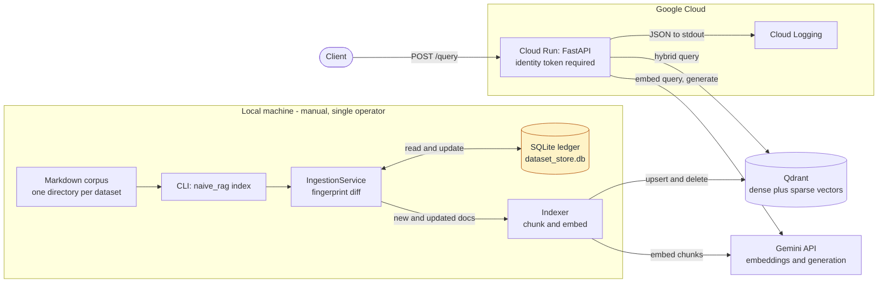
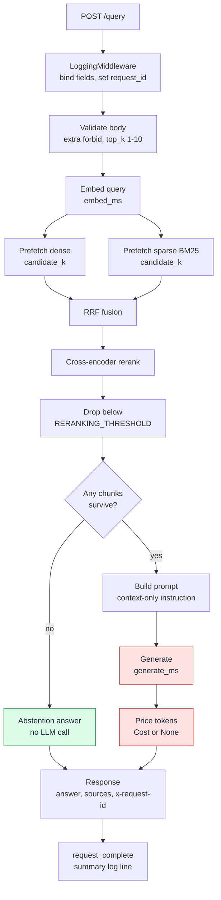

# ritam RAG V2 Architecture

This document describes the architecture as it stands after v1. Where v1 was "does RAG work end
to end", v2 is about making the thing measurable: a real vector store, incremental ingestion,
per-request cost accounting, and an eval set that gates changes in CI.

The v1 document is still in [rag_v1_architecture.md](rag_v1_architecture.md) and is worth
reading first — this one is written as a delta against it, not a replacement.

## Table of Contents
- [What changed from v1](#what-changed-from-v1)
- [High-level architecture](#high-level-architecture)
- [Layered architecture](#layered-architecture)
- [Components](#components)
  - [Document sources](#document-sources)
  - [Ingestion and the SQLite ledger](#ingestion-and-the-sqlite-ledger)
  - [Indexer](#indexer)
  - [Vector store](#vector-store)
  - [Retriever](#retriever)
  - [RAG service](#rag-service)
  - [LLM client and error taxonomy](#llm-client-and-error-taxonomy)
  - [Cost accounting](#cost-accounting)
  - [FastAPI service](#fastapi-service)
- [Request and data flow](#request-and-data-flow)
- [Observability](#observability)
- [Evaluation and the regression gate](#evaluation-and-the-regression-gate)
- [Deployment](#deployment)
- [Constraints and limitations](#constraints-and-limitations)

## What changed from v1

| | v1 | v2 |
|---|---|---|
| Vector store | `assets/indexed_chunks.json`, loaded into memory at startup | Qdrant, dense + sparse named vectors |
| Retrieval | cosine similarity in Python | dense + BM25 fused with RRF, then cross-encoder rerank |
| Filtering | top-k only | `RERANKING_THRESHOLD` on cross-encoder logits, with abstention |
| Indexing | full rebuild, baked into the image | incremental, fingerprint-diffed against a SQLite ledger |
| Datasets | one fixed corpus | named datasets, isolated by payload filter |
| Cost | not tracked | tokens and USD per request, in the logs and eval results |
| Structure | `rag_core` module | enforced layers, protocol boundaries, `import-linter` contract |
| Quality gates | pytest, ruff | + strict mypy, import-linter, pre-commit, eval regression gate in CI |
| Errors | provider exceptions surfaced upward | typed taxonomy mapped at the client edge |

The single biggest structural change is that the index is no longer part of the deployment
artifact. In v1 a content change meant re-indexing, rebuilding the image, and redeploying. In v2
the index lives in Qdrant, so content and code ship independently.

## High-level architecture

v2 has two flows that run in different places and share exactly one thing. Indexing is manual and
local; serving is deployed and stateless. Qdrant is the only state they have in common.



The highlighted node is the asymmetry worth noticing. Qdrant is shared, durable, and reachable
from both flows. The ledger is none of those — it exists on one machine, is untracked by git, and
nothing in the deployed system can see it. That is what makes the local-state constraint at the
bottom of this document a cost risk rather than a correctness risk: losing the ledger doesn't
corrupt Qdrant, because point IDs are deterministic, but it does mean the next index run re-embeds
the entire corpus and you pay for it again.

## Layered architecture

```
api → core → document_source → retrieval → vector_store → llm → cost → (observability | config)
```

Imports flow downward only. The contract is declared in `pyproject.toml` and enforced by
`import-linter` in both pre-commit and CI, so a violation fails the build instead of being caught
(or not) in review.

The boundaries that matter:

- `LlmClient`, `VectorStoreClient`, `DocumentSource`, and `TextReranker` are all `Protocol`s.
  Upper layers depend on the capability, not the implementation — which is what lets tests
  substitute deterministic fakes without touching a network.
- `core/factories.py` is the only place that reads settings to choose an implementation. Nothing
  below `core` knows a config file exists.
- `observability` and `config` sit at the bottom and are independent of each other, so any layer
  can log without creating a cycle.

## Components

### Document sources

`DocumentSource.load(dataset)` returns `(doc_path, doc_content)` pairs. `LocalDocumentSource`
parses a `file://` URI from `SOURCE_URI`, resolves `<root>/<dataset>`, and globs `**/*.md`.
`doc_path` is stored relative to the dataset directory, which is why eval `expected_docs` are
relative too.

The protocol exists so a future object-store or Git-backed source drops in without touching
ingestion. Only the local implementation exists today; `create_document_source_client` raises
`NotImplementedError` for any other scheme rather than silently mishandling it.

### Ingestion and the SQLite ledger

`IngestionService` makes indexing incremental and idempotent. Each document gets an
`index_fingerprint` = `sha256(chunk_size + separator + content)`, recorded in SQLite keyed on
`(doc_path, dataset, embedding_model)`.

On each run it diffs source against ledger and classifies every document as new, updated,
unchanged, or deleted. Only new and updated documents are re-embedded; updated and deleted ones
are first deleted from the store by `doc_path` filter, so a shrinking document doesn't leave
orphaned chunks behind.

Because the key includes `embedding_model`, switching models finds no prior records and triggers
a full rebuild — correct, since vectors from different models aren't comparable. Because it
includes `chunk_size` and `chunk_separator` via the fingerprint, changing chunking re-indexes
everything it affects. Full detail in [ingestion_v2.md](ingestion_v2.md).

The ledger is local state. That's a deliberate scope decision — see [Constraints](#constraints-and-limitations).

### Indexer

`Indexer.build_index` chunks each document and embeds each chunk. Chunking walks the content in
`chunk_size` windows and, when a window would split mid-content, backs up to the last
`chunk_separator` before the boundary — so chunks land on paragraph edges where possible rather
than mid-sentence, without a chunk ever exceeding the configured size.

Each chunk carries `doc_path` (the document, used for matching and deletion) and `source`
(`<doc_path>#chunk-<n>`, used for citation). Keeping those distinct is what lets the eval match
on documents while the API cites chunks.

### Vector store

Qdrant, one collection per embedding model (name derived by slugifying the model name), with
datasets isolated inside a collection by a `dataset` payload filter. Payload indexes are created
on `dataset` and `doc_path`, the two fields the query filter and the delete path filter on.

Each point carries two named vectors: `dense` (the embedding, cosine distance) and `sparse`
(BM25, IDF modifier). Queries prefetch `limit` candidates from each and fuse them with Reciprocal
Rank Fusion, then a cross-encoder reranks the fused candidates and anything below
`RERANKING_THRESHOLD` is dropped.

Three details in here are load-bearing:

- **`with_vectors=False` on query.** Nothing downstream reads stored vectors back, and fetching
  them would ship a full embedding per candidate on every single query.
- **Schema assertion before upsert.** Collections built before the hybrid schema carry a single
  unnamed vector; upserting the new point shape into one fails deep inside the client with an
  unhelpful message. `_assert_hybrid_schema` fails loudly and tells you to rebuild instead.
- **Empty results cost one extra round-trip, and only when empty.** If a query returns nothing,
  the store counts the dataset to distinguish "never indexed" (a 404, caller error) from
  "indexed, nothing matched" (a valid empty answer). The count only runs on the empty branch,
  never on the hot path.

BM25 length normalisation compares each point against the collection's average document length,
so `store` passes `avg_len` computed across the batch being written.

The file-based store still exists behind `VECTOR_STORE=file`. It is deprecated and kept only so
older eval runs remain reproducible.

### Retriever

`Retriever.search` computes `candidate_k = min(top_k × 3, 10)`, embeds the query, delegates the
hybrid query to the store, and records `candidate_k`, `embed_ms`, `retrieve_ms`, and
`chunks_returned` onto the request's observability fields.

Retrieving more candidates than are returned is what gives the reranker something to reorder. The
multiplier and cap are currently constants in `config/variables.py`.

### RAG service

`RagService.answer_question` is the orchestration seam: retrieve, and if nothing survives the
threshold, return a fixed abstention answer without calling the LLM at all. That early return is
both a quality decision and a cost decision — an abstained query costs one embedding call and no
generation.

Otherwise it builds a prompt that instructs the model to answer only from the supplied context,
calls the LLM, prices the result, and returns answer, chunks, cost, and model.

### LLM client and error taxonomy

`GeminiClient` implements `LlmClient`. Provider errors are mapped at the client edge into a typed
hierarchy by status code, never by string-matching provider messages:

| Upstream | Mapped to | `retryable` |
|---|---|---|
| 400 | `LlmInvalidRequestError` | no |
| 401, 403 | `LlmAuthenticationError` | no |
| 429 | `LlmRateLimitError` | yes |
| 5xx | `LlmUnavailableError` | yes |
| anything else | `LlmError` | no |

`retryable` defaults to `False` on the base class, so an unrecognised error is never retried
blindly. Every mapping emits an `upstream_error` log carrying the provider, mapped class,
upstream status, and retryability.

The value of doing this at the edge is that every caller above — API, CLI, eval runner — reacts
to one vocabulary. The API maps it to HTTP status codes, the CLI to exit codes, the eval runner to
error labels in the results file, and none of them import anything Gemini-specific.

### Cost accounting

`calculate_cost` prices a generation from a static per-model table of per-1M-token rates.

The important rule: it returns `Cost | None`, and a `Cost` that exists is always complete and
frozen. When the model has no pricing entry or the provider didn't report token counts, the
result is `None` and the cost fields are left unset — never zero. "Couldn't price this" and "this
was free" have to stay distinguishable, otherwise unpriced traffic silently deflates every cost
number downstream. Both failure paths log a warning naming the model.

Cost is recorded per request in the logs and per row in the eval results, which is what makes
cost-per-query comparable across pipeline changes.

Embedding cost is not tracked. It's negligible next to generation, and the Gemini Developer API
doesn't populate usage metadata on that path anyway.

### FastAPI service

`/health`, `/echo`, `/query`. Request and response models use `extra="forbid"`, so an unknown
field is a 422 rather than a silently ignored typo — which matters for `top_k`, where a typo
would otherwise quietly change the cost of every request.

`LoggingMiddleware` is a raw ASGI middleware rather than a `BaseHTTPMiddleware` subclass. It
binds the per-request field store, stamps `x-request-id` onto the response headers, and emits one
`request_complete` summary line. It defaults the status to 500 when the response never started,
so a crash before any status is set is still recorded as one.

Exception handlers map the typed errors to status codes:

| Condition | Status |
|---|---|
| `IndexNotFoundError` | 404 |
| `VectorStoreError` | 500 |
| `LlmRateLimitError` | 429 |
| `LlmAuthenticationError` / `LlmInvalidRequestError` / `LlmUnavailableError` / `LlmError` | 502 |
| `CustomException` | its own status |

Settings are validated as one object; `api/dependencies.py` catches the `ValidationError` and
returns a configuration error naming the offending fields, rather than blaming whichever
component happened to load settings first.

## Request and data flow

**Indexing (local, manual).**

1. `ritam.naive_rag index --dataset <name>` resolves `SOURCE_URI` and loads `<root>/<dataset>/**/*.md`.
2. `IngestionService` fingerprints each document and diffs against the SQLite ledger.
3. New and updated documents are chunked and embedded; updated and deleted ones are removed from
   Qdrant by `doc_path` filter first.
4. Surviving chunks are upserted with both dense and sparse vectors.
5. The ledger is updated in the same run, and the CLI prints the applied diff.

**Query.**

The fork at the threshold is the part worth drawing: it is the only place the pipeline decides
whether to spend generation tokens at all.



The red nodes are the only ones that cost generation tokens. Everything reaching the green node
costs one embedding call and nothing else — which is why raising the threshold drives measured
cost-per-query down whether or not the system is still answering usefully, and why cost is never
read without coverage beside it.

Step by step:

1. `POST /query` — middleware binds the field store, sets `request_id`, starts the timer.
2. Body validated; `dataset` and `top_k` recorded.
3. Query embedded (`embed_ms`).
4. Qdrant prefetches `candidate_k` dense and `candidate_k` sparse candidates, fuses with RRF
   (`retrieve_ms`).
5. Cross-encoder reranks; anything below threshold is dropped; top-k survive.
6. If nothing survives → abstention answer, no LLM call, no generation cost.
7. Otherwise prompt is built and sent (`generate_ms`); tokens and cost recorded.
8. Response returns answer + sources, with `x-request-id`; middleware emits the summary log.

## Observability

Single-line JSON to stdout, picked up by Cloud Logging without a shipper.

Per-request fields live in **one mutable dict behind a single `ContextVar`**, not one `ContextVar`
per field. This is the detail most likely to be broken by a well-meaning refactor: FastAPI runs a
plain `def` endpoint on a worker thread with a *copy* of the context. Values `set()` inside a copy
die with it, so a per-field `ContextVar` written inside the handler would be invisible to the
middleware logging afterwards. Copying a context copies the *bindings*, so both sides point at the
same dict — mutating it is visible across the thread hop, while each request still binds its own
dict and stays isolated under concurrency.

Reads never bind a store, for the same class of reason: a binding created by a read leaks upward
and every later copy would share that one dict, silently merging separate requests into one.

Each query carries `request_id`, `dataset`, `top_k`, `candidate_k`, `chunks_returned`,
`embed_ms` / `retrieve_ms` / `generate_ms`, `model`, token counts, and the three cost fields.
`stage` is set by a context manager around each pipeline phase, so every line emitted inside it is
attributable to a stage. Non-HTTP entrypoints use `request_scope`, which binds a fresh store per
example — without that, an abstaining eval row would report the previous row's cost.

## Evaluation and the regression gate

`evals/` holds a 78-query set over a deliberately fictional corpus, stratified into factual
(easy/medium/hard), multi-hop, and out-of-scope buckets. Fictional is the point: on real-world
topics the model answers from pretraining and retrieval quality stops being measurable.

`check_regression.py` compares a fresh run against the committed `baseline.json` on retrieval
recall, coverage, and abstention rate, and fails on any decrease. It runs in CI on every push and
PR to `main` against an ephemeral Qdrant service container, rebuilding the index from the in-repo
corpus each run — so the gate measures the code under test rather than the drifting state of a
long-lived cloud collection.

Methodology and dataset format: [../evals/README.md](../evals/README.md). Individual run
write-ups, including superseded conclusions, live under `evals/results/`.

## Deployment

Terraform in `infra/` provisions Artifact Registry, a dedicated service account, Secret Manager
entries for `llm_api_key` / `qdrant_url` / `qdrant_api_key`, and a Cloud Run service that reads
them via `value_source` rather than baked-in env values. The image tag is passed as
`app_version`, so a deploy is an explicit version bump.

The container is a two-stage build: the builder carries a compiler toolchain for any dependency
without a 3.14 wheel, the runtime is slim with no compiler and no `uv`, running as a non-root user
straight out of the baked venv.

Only the query path is deployed. Indexing runs locally against cloud Qdrant, and the ledger is
local too. The service has no `allUsers` invoker binding — it is a real LLM endpoint with a real
bill behind it, so calls need an identity token.

## Constraints and limitations

- **Indexing is local and manual.** No scheduled or event-driven ingestion. A deliberate scope
  call, but it means the ledger lives on one machine: if it's lost, the next run sees every
  document as new and re-embeds the whole corpus. Qdrant would still be correct — upserts are
  keyed deterministically — but you'd pay the full embedding cost again.
- **Single-writer assumption.** Two concurrent indexing runs against the same dataset would race
  on both the ledger and the store. Nothing enforces this today.
- **No caching.** Identical repeated queries pay full embedding and generation cost every time.
- **No retries.** `retryable` is carried on the error taxonomy but nothing acts on it yet; a 429
  or a 5xx surfaces straight to the caller.
- **No per-document diversity in top-k**, so all k slots can come from one document. This is the
  known cause of multi-hop recall lagging factual.
- **The reranker is CPU-bound and adds a cold-start cost** — a model download and load on first
  use, on a service that scales to zero.
- **Difficulty-tier metrics aren't emitted** by the eval runner; only `query_type` breakdowns are.
- **Cost covers generation only.**
